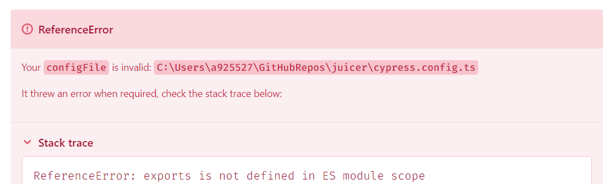

# Juicer

The purpose of this project is to serve as a playground to get familiarized with several technologies and practice design patterns. This document will serve as a kind of log book where the different steps beeing taken are listed and the reasoning behind them explained when deemed worthy of it. 

# React + TypeScript + Vite

The project has been created with Vite as bundler and Babel is beeing used for Fast Refresh:

- [@vitejs/plugin-react](https://github.com/vitejs/vite-plugin-react/blob/main/packages/plugin-react/README.md) uses [Babel](https://babeljs.io/) for Fast Refresh

# TailwindCSS

The CSS framework has been incorporated to the project following the recommended by the developer as of 2/19/2025:

- https://tailwindcss.com/docs/installation/using-vite

# Cypress

Cypress is used to test both components and e2e interactions. Installation and use of plugins can be tricky because of conflicts on how the modules are imported inside the project. The recommended steps as of 19/02/2025 have been followed:

- https://docs.cypress.io/app/get-started/install-cypress
  
After installation, launching the GUI and follwing the guided processes allow you to seemesly set up the project environment both for e2e and component testing... Or so should it be. 

### Component testing
In this case i got this error after the initial setup for component testing:

To resolve this issue I had to specify to the compiler (tsc) that I wanted him to generate ES6 modules, that use the 'export/import' syntax:

    "compilerOptions": {
        "module": "ES6",
    },

After that i encountered another problem. The component was rendered but the styles provided by Tailwind were not included. Just importing <i>index.css</i> from the source folder of the project in <i>component.ts</i> file generated by Cypress in the support folder fixed the issue.

At this point the linter was complaining about the use of outdated syntax in this autogenerated files inside support, specifically the use of namespaces. Since Cypress was using it and it was not a problem that was going to affect runtime execution I opted for disabling the linter warning.

Finally I was able to render a component as expected in the Cypress GUI for its testing.

### e2e testing

Cypress did all the setup and generated an exemaple that was able to run without further tunning of the environment.
In order to visit my locally hosted application, I set up its url as an environment variable in the <i>cypress.config.ts</i> file:

    env: {
        local_url: 'http://localhost:5173'
    },

After that i was able to visit it from my spec file. At this point the project was set for both component and e2e testing with Cypress.

# Design Patterns

## Factory Pattern

This pattern consists in boilerplating how a certain kind of object should be created inside a <b>factory object</b> and then instanciating particular cases according to the requirements in each call to said factory. 

In this project this pattern is applied to the creation of the different forms. Lets see how it applies to the creation of the login form:

First we need to define the Factory...